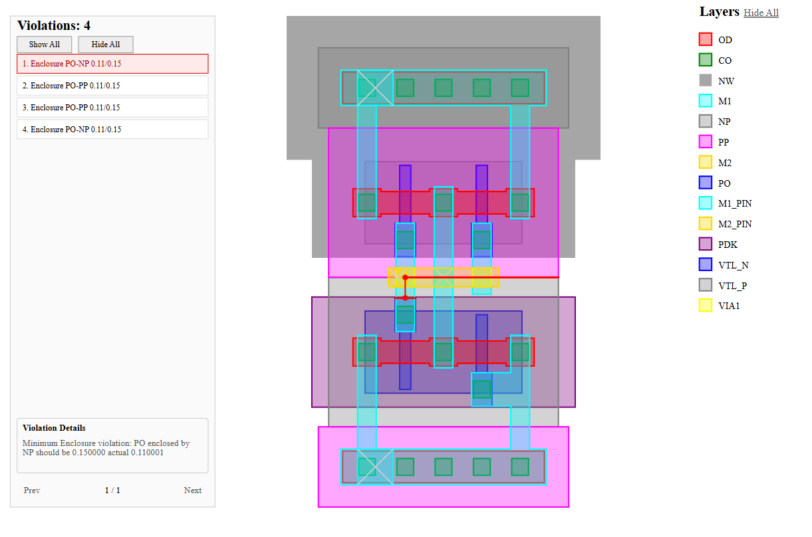

# DRCheck

[](https://github.com/Khaled3ly00/DRChecker/actions/workflows/ci.yml)

DRCheck is a C++ Design Rule Checker for simplified IC layouts. The project focuses on modern C++, computational geometry, IC verification concepts, unit testing, spatial indexing, and evidence-based performance optimization.



*Inverter example rendered by DRCheck's standalone SVG report, with layer controls, selectable violations, and violation details.*

The current end-to-end application and integration tooling can:

- load layout geometry from any producer that emits DRCheck's JSON layout schema;
- load rule and layer definitions from JSON or Tcl decks;
- optionally export supported Cadence Virtuoso geometry to compatible JSON with hierarchy flattening;
- normalize connected same-layer polygons before DRC execution;
- translate parsed rule parameters into validated polymorphic rules through a central factory;
- run the complete DRC/report workflow directly or from Tcl automation scripts;
- run minimum-width, minimum-spacing, minimum-enclosure, and per-layer minimum/maximum density rules;
- check missing enclosure and configure alternative outer layers with all-sides or opposite-pair requirements from C++, JSON, or Tcl;
- build one shared, layer-aware spatial index for a rule run;
- report actual and required rule values;
- attach optional closest-point witnesses, edge indices where applicable, or region-based geometry to violations;
- write machine-readable JSON reports;
- render fitted SVG layouts with highlighted violation geometry, including density regions; and
- provide an interactive, paginated SVG violation browser with layer visibility, selective overlays, hover details, and cursor-centered zoom.

## Current Status

The geometry core, shape model, runtime `Layer`/`LayerRegistry` domain, Clipper2-backed layout normalization, rule framework, centralized `RuleFactory`, JSON and Tcl rule-deck input paths, reusable `DRCRunner`, Tcl automation runner and commands, dual-mode CLI, interactive SVG violation browser, layer-aware violation metadata, QuadTree optimization, reusable spatial-index architecture, density-rule pipeline, and cross-platform CI workflow are implemented. Layers are no longer compiled into DRCheck: each rule deck declares the names available to its layout and rules, and one registry supplies their shared identities throughout the run. The C++ behavior is covered by unit, integration, and end-to-end tests. An optional Cadence SKILL utility can produce compatible JSON, including the physical cut and enclosure geometry generated by supported standard vias.

`DRCEngine` builds one `LayerSpatialIndex` from the current shape collection and passes it to every rule. `MinSpacingRule`, `MinEnclosureRule`, and `DensityRule` reuse that index for layer-specific candidate discovery instead of building rule-local trees or scanning every possible shape.

Before the engine sees a layout, `DRCRunner` passes the parsed shapes through `LayoutNormalizer`. Overlapping or boundary-connected polygons on the same layer are combined into physical connected components, preventing artificial spacing, width, and enclosure results at seams between source figures.

Rule construction is separated from rule-deck decoding. `JSONRuleParser` and `TclRuleParser` validate and convert their input fields into `RuleParameters`, then delegate concrete rule creation and required-parameter validation to `RuleFactory`.

Minimum-enclosure configuration now supports both the legacy single-layer form and a list of `EnclosureOption` alternatives. Each alternative can require a scalar all-boundary minimum or accept all-sides enclosure OR either orientation of an opposite-pair requirement. Inner shapes with no relevant allowed outer geometry are reported again rather than silently ignored.

Complete DRC execution is now separated from `main()`. `DRCRunner` owns layout loading, rule-deck selection, engine execution, and report generation, allowing direct CLI runs and Tcl automation commands to share one workflow.

Detailed benchmark methodology, results, and QuadTree tuning data have moved to [BENCHMARKS.md](BENCHMARKS.md).

## Architecture

```text
rules.json / rules.tcl
        |
        v
JSONRuleParser / TclRuleParser
        |                     \
        |                      +--> RuleParameters --> RuleFactory --> vector<Rule> --+
        v                                                                             |
LayerRegistry                                                                         |
        |                                                                             |
        | resolves                                                                    |
        v                                                                             |
JSONLayoutParser <---- layout.json from any compatible producer                       |
        |                                                                             |
        v                                                                             |
LayoutNormalizer                                                                      |
Clipper2 polygon union                                                                |
        |                                                                             |
        +---------------------------------------> DRCEngine <-------------------------+
                       |
                       | builds once per run
                       v
               LayerSpatialIndex
               one QuadTree per populated layer
                       |
                       | shared read-only access
      +----------------+------------+-------------+
      |                |            |             |
      v                v            v             v
 MinWidthRule MinSpacingRule MinEnclosureRule DensityRule
      |                |            |             |
      +----------------+------------+-------------+
                       |
          exact geometry and density checks
                       |
                       v
              vector<Violation>
                       |
             +---------+---------+
             |                   |
             v                   v
     JSONReportWriter      SVG visualization
```

The design keeps responsibilities separated:

| Module | Responsibility |
|---|---|
| `geometry/` | Geometry primitives, predicates, measurements, and witness results |
| `domain/` | Runtime layer declarations and identity, shapes, violations, and violation markers |
| `layout/` | Connected-component discovery and same-layer polygon normalization |
| `spatial/` | QuadTree storage and layer-aware candidate queries |
| `rules/` | Rule-specific DRC semantics and centralized rule construction |
| `engine/` | Shared-index construction, rule orchestration, and reusable end-to-end DRC execution |
| `io/` | JSON layout parsing, JSON/Tcl rule-deck parsing, Tcl automation, parameter conversion, JSON reporting, and interactive SVG generation |
| `scripts/virtuoso/` | Optional Cadence SKILL adapter that exports layout geometry to compatible DRCheck JSON |

## Layout JSON and Layers

`JSONLayoutParser` is DRCheck's layout-input boundary. It accepts layouts from hand-written files, generators, EDA exporters, or any other producer that emits the documented schema. Layouts use micrometers and require a top-level `units` field set to `"um"` plus a `shapes` array. Every shape must provide an integer `id`, a declared `layer`, and polygon `vertices`:

```json
{
  "units": "um",
  "shapes": [
    {
      "id": 42,
      "sourceType": "rect",
      "layer": "M1",
      "vertices": [
        [0.0, 0.0],
        [10.0, 0.0],
        [10.0, 5.0],
        [0.0, 5.0]
      ]
    }
  ]
}
```

The parser preserves each supplied ID instead of generating a replacement. Extra exporter metadata such as `source`, `library`, `cell`, `view`, `hierarchyDepth`, and per-shape `sourceType` can remain in the document; the checker consumes only the fields needed by its geometry model. Direct parser callers therefore receive the source IDs, while the complete `DRCRunner` path subsequently normalizes the layout and assigns new sequential IDs to the normalized physical shapes.

There is no compiled-in layer vocabulary. The selected JSON or Tcl rule deck defines the valid names for a run, and `JSONLayoutParser` resolves every shape name through that deck's `LayerRegistry`. For example, a layout containing `M1` is valid when its JSON deck declares `"layers": ["M1", ...]` or its Tcl deck evaluates `layer M1` before rules that use it. This permits different technologies and naming conventions without changing C++ source code.

`Shape` stores its ID, a non-owning pointer to its canonical registered `Layer`, and its `Polygon`. Two shapes are considered to share a layer when they reference the same registry-owned object, not because each carries an independently copied string or enum value.

Undeclared layer names, missing required shape fields, non-numeric vertices, unsupported units, and invalid polygons are rejected with exceptions rather than silently normalized.

## Cadence Virtuoso Layout Export

Virtuoso is one optional source of layout JSON, not a required stage in the DRCheck pipeline. The checker itself starts from any file that follows the schema above. For Cadence users, the repository includes `scripts/virtuoso/layout_export.il`, a SKILL adapter that exports the active Virtuoso layout cellview into that same schema.

Load it inside Virtuoso and call `exportLayoutJson()` with an output path and hierarchy depth:

```lisp
load("/path/to/DRChecker/scripts/virtuoso/layout_export.il")

; Top-level geometry only
exportLayoutJson("/path/to/layout_top.json" 0)

; Copy instances into a scratch cellview and flatten up to depth 32
exportLayoutJson("/path/to/layout_flat.json" 32)
```

The exporter:

- reads the currently edited layout cellview;
- copies geometry into a temporary scratch cellview so the source layout is not flattened in place;
- exports rectangles and polygons directly;
- converts `path` and `pathSeg` objects to polygon vertices;
- reads effective standard-via parameters by applying placed-via header overrides over the technology defaults;
- converts each supported `1 x 1` standard via into three physical rectangles: its cut, layer-1 enclosure, and layer-2 enclosure;
- honors the via origin offset plus the independent layer-1 and layer-2 offsets and enclosure values;
- skips text and label annotation objects;
- assigns stable sequential IDs within the exported file; and
- records the Virtuoso source, library, cell, view, requested hierarchy depth, micrometer units, source object type, layer, and vertices.

A flatten depth of `0` exports only top-level shapes and vias. A positive depth copies and flattens instances to the requested level and warns when instances remain. Via-derived JSON objects use `stdViaCut` for the cut layer and `stdViaEnclosure` for each surrounding conductor layer, with a distinct shape ID for every emitted region. Geometry is extracted before separators are written, so skipped or unsupported figures do not leave malformed commas in the JSON array.

The checked-in inverter material under `examples/inverter_example/` demonstrates top-level and flattened exports, Tcl rules, normalized JSON reports, and interactive SVG output.

## Rule Construction and JSON Parsing

`RuleFactory` centralizes construction of every supported concrete rule behind one interface:

```cpp
static std::unique_ptr<Rule> create(
    const std::string& type,
    const RuleParameters& params
);
```

`RuleParameters` is a shared parameter object containing non-owning `const Layer*` fields for single-layer and inner/outer-layer rules, numeric thresholds, density configuration, an optional `BoundingBox` analysis window, and `std::optional<std::vector<EnclosureOption>> enclosureOptions`. The factory validates the fields required by the requested rule before returning a `std::unique_ptr<Rule>`.

| JSON rule type | Factory key | Required parameters | Optional parameters |
|---|---|---|---|
| `MinWidth` | `min_width` | `layer`, `value` | none |
| `MinSpacing` | `min_spacing` | `layer`, `value` | none |
| `MinEnclosure` (legacy) | `min_enclosure` | `innerLayer`, `outerLayer`, `value` | none |
| `MinEnclosure` (options) | `min_enclosure` | `innerLayer`, non-empty `enclosureOptions` | both opposite-pair thresholds within an option |
| `Density` | `density` | `layer`, `limit`, `value`, `windowSize`, `windowStep` | `analysisWindow` |

`JSONRuleParser` remains responsible for the JSON-facing concerns:

1. opening and decoding the rule file;
2. requiring top-level `layers` and `rules` arrays;
3. declaring each layer name in the run's `LayerRegistry` and rejecting empty or duplicate declarations;
4. resolving every rule layer reference to its canonical registry-owned `Layer`;
5. converting density limits from `Minimum` or `Maximum`;
6. parsing optional analysis-window bounds from `minX`, `minY`, `maxX`, and `maxY`;
7. decoding enclosure-option objects and requiring opposite-pair values together;
8. populating `RuleParameters`; and
9. mapping the external JSON type to the internal factory key and delegating construction.

`JSONRuleParser::load()` is now a static entry point. JSON-specific density-limit and bounding-box helpers remain inside the implementation file, keeping `nlohmann/json` and density parsing details out of the public parser header.

```text
rules.json
       |
       v
JSONRuleParser
layer declarations and field validation
       |
       +------> LayerRegistry
       |
       v
RuleParameters
       |
       v
RuleFactory::create()
required-parameter validation
       |
       v
unique_ptr<Rule>
```

The factory rejects missing required parameters and unknown factory keys with `std::invalid_argument`. The parser separately rejects malformed rule-file structure, unknown JSON rule types, and unsupported density-limit strings. This keeps JSON representation concerns out of concrete rule constructors while giving programmatic callers the same validated construction path.

### Minimum-enclosure JSON formats

The legacy single-outer-layer rule representation remains available inside a deck that declares its layers:

```json
{
  "layers": ["VIA1", "M1"],
  "rules": [
    {
      "type": "MinEnclosure",
      "innerLayer": "VIA1",
      "outerLayer": "M1",
      "value": 0.03
    }
  ]
}
```

The new form can mix simple and pairwise alternatives in one rule:

```json
{
  "layers": ["CO", "M1", "PO"],
  "rules": [
    {
      "type": "MinEnclosure",
      "innerLayer": "CO",
      "enclosureOptions": [
        {
          "outerLayer": "M1",
          "allSidesMinEnclosure": 0.04,
          "firstPairMinEnclosure": 0.00,
          "secondPairMinEnclosure": 0.06
        },
        {
          "outerLayer": "PO",
          "allSidesMinEnclosure": 0.04
        }
      ]
    }
  ]
}
```

Every option requires `outerLayer` and `allSidesMinEnclosure`. Omitting both pair fields creates a simple option; supplying both creates a pairwise option. Supplying only one pair field or an empty/non-array `enclosureOptions` value is rejected. The option constructors validate the threshold values, and `MinEnclosureRule` rejects an outer layer equal to its inner layer.

`RuleFactory` requires `innerLayer` in both forms. When `enclosureOptions` is present, it forwards that vector to the multi-option constructor; otherwise it requires the legacy `outerLayer` and `value`. JSON follows the same precedence, so use one representation per rule object. `examples/rules.json` includes one simple option, multiple simple options, multiple pairwise options, and mixed simple/pairwise options.

## Tcl Rule-Deck Parsing

`TclRuleParser` adds a second rule-deck front end without changing the rule or engine interfaces. Its static `load()` function creates a Tcl interpreter, registers the DRCheck-specific `layer` and `rule` object commands, evaluates the requested file, and returns the resulting polymorphic rules. Each layer must be declared before the first rule that references it; duplicate declarations and undeclared rule-layer references are rejected.

The supported Tcl declarations mirror the four JSON rule families:

```tcl
layer M1
layer M2
layer VIA1

rule min_width -layer M1 -value 0.20
rule min_spacing -layer M1 -value 0.25
rule min_enclosure -inner VIA1 -outer M1 -value 0.10
rule density -layer M1 -limit minimum -value 0.30 -window_size 10 -window_step 5
rule density -layer M2 -limit maximum -value 0.70 -window_size 20 -window_step 10 -region {0 0 100 100}
```

Rule options are parsed as `-option value` pairs and stored by name, so their order does not affect the result. The parser rejects malformed pairs, duplicate options, missing required options, unexpected rule-specific options, unsupported rule types, invalid numeric values, and density limits other than `minimum` or `maximum`.

Minimum-enclosure decks can also use `-inner` with a non-empty `-options` list. Each list entry contains named option/value pairs, not positional numeric values:

```tcl
# Equivalent to the mixed-option JSON rule above
rule min_enclosure -inner CO -options {
    {-outer M1 -all_sides 0.04 -first_pair 0.00 -second_pair 0.06}
    {-outer PO -all_sides 0.04}
}
```

The option fields map directly to the common enclosure model:

| JSON field | Tcl option | Meaning |
|---|---|---|
| `outerLayer` | `-outer` | Allowed outer layer |
| `allSidesMinEnclosure` | `-all_sides` | All-sides threshold |
| `firstPairMinEnclosure` | `-first_pair` | Threshold for one opposite pair |
| `secondPairMinEnclosure` | `-second_pair` | Threshold for the other opposite pair |

Each entry requires `-outer` and `-all_sides`; `-first_pair` and `-second_pair` must appear together or both be omitted. `parseEnclosureOptions()` uses Tcl's list API, validates each entry independently, and rejects empty lists, odd-length pairs, duplicate names, unknown fields, and incomplete pair requirements. Field order within an entry is flexible. At the rule level, `-options` cannot be mixed with legacy `-outer`/`-value` arguments. The existing `rule min_enclosure -inner ... -outer ... -value ...` form remains supported.

Both front ends construct the same `EnclosureOption` values and pass them through `RuleParameters::enclosureOptions` and `RuleFactory`. The options are alternatives: one passing outer option is sufficient. Separate rule declarations remain separate requirements, so declaring enclosure by M1 and enclosure by M2 as two rules requires both checks to pass.

For density rules, `-region` is optional. When present, it must be a Tcl list containing exactly four numeric values in `minX minY maxX maxY` order. The parser uses Tcl's list API rather than splitting the string manually and uses the count type required by either Tcl 8 or Tcl 9 at compile time.

```text
rules.tcl
    |
    v
Tcl_EvalFile()
    |
    v
registered layer/rule commands
layer declaration, option validation, and conversion
    |
    +------> LayerRegistry
    |
    v
RuleParameters
    |
    v
RuleFactory::create()
    |
    v
unique_ptr<Rule>
```

The callback converts C++ exceptions into Tcl command errors. If deck evaluation fails, `TclRuleParser` captures the interpreter message, destroys the interpreter, and reports the failure as `std::invalid_argument`. No Tcl-specific object crosses the `RuleFactory` boundary.

CMake adds the Tcl parser and automation sources to the main library, probes for Tcl with `find_package(TCL QUIET)`, emits an explicit fatal error when the development files are unavailable, and keeps the Tcl include path and library linkage private to the `drchecker` target.

## Reusable DRC Execution and Tcl Automation

`DRCRunner` extracts the complete application workflow from `main()` into a reusable engine-level service. Callers supply one configuration object:

```cpp
struct DRCRunConfig
{
    std::string layoutPath;
    std::string rulesPath;
    std::string reportPath;
    std::optional<std::string> svgPath;
};
```

`DRCRunner::run()` then:

1. creates one `LayerRegistry` for the complete run;
2. selects `JSONRuleParser` or `TclRuleParser` from the rule-deck extension, then loads layer declarations and rules into that registry;
3. loads the JSON layout and resolves every shape through the same registry;
4. normalizes connected same-layer source figures into physical shapes;
5. runs the rules through `DRCEngine`;
6. always writes the configured JSON report;
7. writes an SVG report when `svgPath` is present; and
8. returns the generated violations.

The registry remains alive until rule execution and report generation finish because shapes, rules, enclosure options, violation markers, and the spatial index use non-owning pointers to its `Layer` objects.

This same function is used by direct CLI mode and Tcl automation, so parsing, execution, and report behavior are not duplicated in `main()` or Tcl callbacks.

`TclAutomationRunner::run()` creates a Tcl interpreter with two DRCheck-specific commands:

| Command | Parameters | Behavior |
|---|---|---|
| `drc_run` | required `-layout`, `-rules`, `-report`; optional `-svg` | Builds a `DRCRunConfig`, executes the complete workflow, and stores the resulting violations as the latest run |
| `drc_error_count` | none | Returns the latest run's violation count as a Tcl integer |

`drc_run` accepts option/value pairs in any order and rejects malformed pairs, duplicate options, missing required options, and unknown options. Because report generation is already part of `DRCRunner`, the automation interface does not add a separate export command.

Automation scripts can combine these commands with Tcl's existing variables, command substitution, conditionals, output, and file-path operations; more in examples/

Resolving paths from `[info script]` makes the automation file independent of the executable's working directory.

One automation script can call `drc_run` multiple times. Each call executes and writes its own report, while the shared automation context replaces its stored violation vector with the newest result. Consequently, `drc_error_count` and the vector returned by `TclAutomationRunner::run()` describe only the most recent run; V1 does not retain run history.

```text
main()
  |
  +-- direct options --------------------+
  |                                      |
  |                                      v
  |                                  DRCRunner
  |                                      ^
  +-- --script --> TclAutomationRunner --+
                       |
                       +-- drc_run
                       +-- drc_error_count

DRCRunner
  -> create LayerRegistry
  -> load JSON/Tcl layer declarations and rules
  -> load layout through the same registry
  -> normalize connected same-layer geometry
  -> DRCEngine
  -> JSON report
  -> optional SVG report
  -> violations
```

Tcl command exceptions are returned through the interpreter as command errors. If script evaluation fails, `TclAutomationRunner` captures the Tcl message, destroys the interpreter, and throws `std::invalid_argument`.

## Shared `LayerSpatialIndex`

`LayerSpatialIndex` owns one `QuadTree` for each populated layout layer:

```text
LayerSpatialIndex
├── M1 -> QuadTree
├── M2 -> QuadTree
└── VIA1  -> QuadTree
```

Construction follows two stages:

1. Group pointers to the input shapes by `Layer`.
2. For each populated layer, merge its shape bounding boxes into a root boundary, build a QuadTree, and insert the layer's shapes.

The index owns the QuadTrees but does not copy or own the shapes. Its trees store `const Shape*` values that refer to the caller-owned `std::vector<Shape>`. The indexed shape collection must therefore remain alive and stable while the index is in use.

The public query stays independent of the underlying tree implementation and uses canonical layer identity:

```cpp
std::vector<const domain::Shape*> query(
    const domain::Layer* layer,
    const geometry::BoundingBox& region
) const;
```

Queries against absent layers return an empty result, and an empty layout is valid.

### Broad phase and narrow phase

The spatial index is a broad-phase filter. It returns shapes whose bounding boxes make them plausible candidates; it does not replace exact polygon geometry.

```text
QuadTree query
    -> inexpensive candidate filtering

Polygon::distanceTo() / Polygon::contains()
    -> exact DRC decision
```

`DensityRule` uses the same broad-phase contract: it queries only its target layer for each density window, then calls `Polygon::areaInsideWindow()` for exact covered-area calculation. This distinction is important for concave polygons and other cases where bounding-box overlap alone does not prove the corresponding polygon relationship or coverage.

## Layout Normalization

Virtuoso and other layout sources commonly represent one physical conductor as several overlapping or edge-adjacent figures. Running DRC directly on those source fragments can create false internal spacing or width results. `LayoutNormalizer::normalize()` converts the parsed figure list into the physical polygon set used by `DRCEngine`, JSON reports, and SVG reports.

Two shapes are mergeable when they are on the same `Layer` and their polygons either share positive area or share a boundary segment of positive length. A single shared vertex is not enough. Shapes on different layers and separated shapes remain independent.

Normalization proceeds as follows:

```text
raw JSON shapes
      |
      v
LayerSpatialIndex broad-phase queries
      |
      v
BFS connected-component discovery
Polygon::overlaps() or sharesBoundarySegment()
      |
      v
Clipper2 union for each multi-shape component
      |
      v
normalized shapes with sequential IDs
      |
      v
DRCEngine + JSON/SVG reports
```

`collectConnectedComponent()` performs breadth-first search, so transitive connectivity is preserved: if A merges with B and B merges with C, all three enter one component even when A and C do not touch directly. Candidate discovery uses the shared layer index, while `areMergeable()` performs the exact polygon decision.

`mergeComponent()` converts component polygons to Clipper2 paths, normalizes their orientation, and performs a `NonZero` union with `CLIPPER_PRECISION = 5`, corresponding to a `0.00001` micrometer (`0.01` nm) coordinate grid. A merged shape keeps the component's layer. Single-shape components are copied without a union, but all normalized output receives deterministic IDs beginning at `1`.

The current polygon domain model cannot represent holes or a disconnected multi-contour result inside one `Shape`. Normalization therefore rejects a union that produces anything other than one contour instead of silently discarding geometry.

## Geometry Core

The geometry layer is isolated under `drcheck::geometry` and contains no rule or layer knowledge.

### `Point` and `Vector`

- coordinate and vector storage;
- vector construction between points;
- orientation tests;
- length, dot product, and cross product.

### `BoundingBox`

- overlap and containment checks;
- merging;
- expansion by a search distance;
- access to minimum and maximum coordinates.

### `Segment`

- constructor rejection of degenerate segments;
- point containment and segment intersection;
- point-to-segment and segment-to-segment distance;
- closest-point witness calculation.

### `Polygon`

- constructor-enforced validity;
- edge generation, signed area, area, and orientation;
- bounding-box calculation;
- point and polygon containment with explicit boundary handling;
- polygon intersection and polygon-to-polygon distance;
- positive-area polygon overlap detection through `overlaps()`;
- positive-length shared-boundary detection through `sharesBoundarySegment()` without treating vertex-only contact as an edge connection;
- minimum width for orthogonal polygons;
- rectangular-inner/orthogonal-outer directional enclosure through `pairwiseEnclosure()`;
- polygon area clipped to an axis-aligned bounding box through `areaInsideWindow()`; and
- detailed edge-pair and closest-point results.

Detailed measurements preserve the geometry that produced them. `DistanceResult` stores the distance and closest points, while `PolygonEdgePairResult` also identifies the corresponding polygon edges. Rules select only the witness data needed by their reports: width violations retain points and edge indices, while spacing and enclosure violations retain the closest-point pair without edge indices.

`contains(const Polygon&, bool includeBoundary = false)` now defaults to strict containment. Passing `true` allows boundary touching or shared boundary segments while still rejecting proper crossings. The point overload retains its boundary-inclusive default. `MinEnclosureRule` explicitly requests boundary-inclusive polygon containment so touching geometry can be measured and evaluated against the configured requirement.

`PairwiseEnclosureResult` contains four raw directional measurements: `left`, `right`, `bottom`, and `top`. Calling `innerPolygon.pairwiseEnclosure(outerPolygon)` requires an axis-aligned rectangular inner polygon and an orthogonal outer polygon, which may be concave. The private `isAxisAlignedRectangle()` helper compares polygon area with bounding-box area; combined with the orthogonality check, it also accepts rectangles represented with extra collinear vertices.

The calculation considers outer edges with positive projected overlap against the corresponding inner span, classifies them relative to the inner rectangle's center, and keeps the minimum signed clearance for each side. Zero means touching; a negative value records boundary intrusion rather than being clamped away inside the geometry layer. Unsupported polygon types throw `std::invalid_argument`, and an unresolved directional measurement throws `std::logic_error`. `PairwiseEnclosureResult` does not itself contain witness points or edge indices.

## Domain Model and Violation Reporting

`Layer` is now a runtime domain object identified by its name rather than a compile-time enum. A `LayerRegistry` owns every layer declared by one rule deck, rejects empty and duplicate declarations, and resolves a name to the same canonical `const Layer*` on every lookup. Its heap-owned layer objects retain stable addresses even if the registry's internal map grows. The registry is deliberately non-copyable and non-movable so those identities cannot be invalidated accidentally.

`Shape` combines a unique ID, a non-null layer pointer, and a polygon. Rules, enclosure options, violation markers, and `LayerSpatialIndex` use the same pointer identity. These pointers are non-owning, so the `LayerRegistry` must outlive every object produced from it; `DRCRunner` enforces that lifetime for a complete application run.

A `Violation` records:

- violation type;
- participating shape IDs;
- explanatory message;
- actual measured value;
- required rule value; and
- an optional `ViolationMarker`.

`ViolationMarker` supports optional witness points, polygon-edge indices, and a region. `MinWidthRule` stores two witness points plus the two corresponding edge indices. `MinSpacingRule` and `MinEnclosureRule` store only their two closest witness points; their `firstEdgeIndex` and `secondEdgeIndex` fields remain unset. Window-based density violations store a region instead. The marker also carries optional non-owning `firstLayer` and `secondLayer` pointers so a report can describe the physical layer or layer pair independently of shape lookup. Width, spacing, enclosure, and density rules populate the applicable layer fields; `DensityRule` uses the region form plus `firstLayer` to identify the exact failing window and its target layer.

`JSONReportWriter` serializes marker fields only when they are present. Width markers can therefore contain `firstPoint`, `secondPoint`, `firstEdgeIndex`, and `secondEdgeIndex`, while spacing and enclosure markers emit their points without edge-index fields. Region markers emit the bounds needed by downstream consumers. Reported actual values, witness coordinates, and region bounds are rounded to avoid floating-point noise. The SVG writer consumes the marker layer fields for human-readable violation summaries and measurement labels.

An unenclosed inner shape produces an `Enclosure` violation with only its own shape ID, the message `Inner shape is not enclosed by any allowed outer layer`, and `actual = 0.0`, `required = 0.0`. Its marker identifies `firstLayer` but has no point, edge, or region witness. Those zero values describe the missing-enclosure case, not a configured zero threshold; consumers should inspect the message and participating IDs.

## Interactive SVG Visualization

`SVGReportWriter` renders the complete layout and any region-only violations into a fixed logical `1600 x 800` viewport. `SvgTransform` fits and centers the geometry between a left violation panel and the right layer legend, preserves aspect ratio, and flips the layout Y axis into SVG coordinates. Report bounds include both shape geometry and region markers, so a density window outside the merged shape bounds is still visible.

The renderer has no built-in PDK or fixed list of layer names. It hashes each runtime layer name with a deterministic FNV-1a function and maps the result into a 16-color palette, so a given name keeps a consistent color without requiring a source-code change. Different names can share a palette color when their hashes select the same entry; the legend still keeps them as separate identities.

Shapes are stable-sorted alphabetically by layer name before drawing, which provides deterministic stacking while preserving source order within a layer. Any layer whose name ends in `_PIN` also receives a light-gray diagonal cross so pin geometry remains visible over routing geometry. Layer groups and violation rows carry the registered layer names in their `data-layer`/`data-layers` attributes, allowing the generated JavaScript to apply visibility controls to arbitrary rule-deck-defined layers.

Only layers that exist in the current layout appear in the legend. It provides clickable per-layer controls plus `Hide All`/`Show All`. Hiding a layer hides its shapes, related violation-list rows, and any active shape-referenced overlays associated with that layer.

The left panel turns the standalone SVG into a lightweight violation browser. It shows the total violation count and one compact row per violation containing its number, type, available marker layer or layer pair, and `actual/required` values. Overlays start hidden rather than covering the layout all at once. Clicking a row independently toggles the geometry available for that violation: width can show its two witness edges, measurement line, and points; spacing and enclosure show only their measurement line and closest points; density shows its region. Active rows receive distinct highlighting. Panel-level `Show All` marks every row active and immediately reveals overlays for currently visible rows; `Hide All` clears every selection and overlay. Page/layer updates then synchronize active overlays with layer visibility.

The list is paginated at 16 violations per page with `Prev`, `Next`, and a page indicator, including a valid `1 / 1` state for an empty list. Pagination changes the visible list rows without clearing selected overlays from another page; hiding a related layer does clear the affected selection and overlay.

A dedicated `Violation Details` box displays `Violation::getMessage()` when a row is activated. Deselecting a row returns to `Select a violation` when nothing remains selected, or `Multiple violations selected` otherwise. `Show All` displays `All violations are shown`, while `Hide All` restores the selection prompt. This also exposes the reason for missing-enclosure violations, which have a list entry but no geometric witness to draw. Details currently use a single SVG text line rather than automatic wrapping.

When an active closest-point violation is hovered, its two-line label shows the violation type, available marker layers, and `actual/required` measurement. Shapes provide an SVG tooltip with their normalized shape ID and layer.

The generated SVG contains its own JavaScript and remains a standalone file:

- mouse-wheel input zooms the internal `viewBox` around the cursor;
- zoom is bounded between the full report and approximately `10x` magnification;
- zooming back to the full extent restores the original view; and
- pressing `F` resets the report immediately to its fitted full view.

No server or external JavaScript dependency is required to use these interactions in an SVG-capable browser.

## Implemented Rules

### Rule-comparison tolerance

`rules::DRC_LENGTH_TOLERANCE`, declared in `include/drcheck/rules/Constants.h`, is `0.0001` micrometers (`0.1` nm). Width, spacing, and enclosure threshold comparisons use this tolerance independently of `geometry::EPSILON`, which remains responsible for geometric predicates. This separates the physical comparison policy from Clipper's finer normalization precision and from report rounding.

For pairwise enclosure, small negative side clearances in `[-DRC_LENGTH_TOLERANCE, 0)` are treated as zero before checking requirements. Larger negative clearances fail the candidate rather than being accepted by a zero-valued pair threshold. The current `DensityRule` also uses the same numeric constant for window-grid termination and density-ratio comparisons; its dimensionless threshold tolerance is not separately configurable yet.

### `MinWidthRule`

Checks shapes on one target layer using the orthogonal-polygon minimum-width calculation. When a violation is found, the detailed width result supplies the two boundary witnesses used by its marker.

### `MinSpacingRule`

For every shape on the target layer, the rule:

1. expands the shape bounding box by the required minimum spacing;
2. queries that layer through the shared `LayerSpatialIndex`;
3. removes self-pairs and duplicate A-B/B-A pairs; and
4. calls `Polygon::distanceTo()` for exact spacing and the closest-point witness pair.

```text
target-layer shape
        |
expanded bounding box
        |
LayerSpatialIndex::query(target layer, region)
        |
nearby candidates only
        |
exact Polygon::distanceTo()
```

### `MinEnclosureRule`

Supports the original single-outer-layer rule and a set of alternative enclosure options through C++, JSON, and Tcl:

```cpp
LayerRegistry layers;

const Layer* via1 = layers.declare("VIA1");
const Layer* m1 = layers.declare("M1");
const Layer* co = layers.declare("CO");
const Layer* od = layers.declare("OD");
const Layer* po = layers.declare("PO");

MinEnclosureRule single(
    via1,
    m1,
    0.03
);

MinEnclosureRule alternative(
    co,
    {
        EnclosureOption(od, 0.015),
        EnclosureOption(po, 0.01)
    }
);

MinEnclosureRule pairwiseAlternative(
    co,
    {
        EnclosureOption(m1, 0.04, 0.00, 0.06),
        EnclosureOption(po, 0.04)
    }
);
```

The options have `OR` semantics: the inner shape passes when any candidate on any allowed outer layer satisfies its option. Simple and pairwise options may be mixed in one rule. The original constructor delegates to the same representation with one `EnclosureOption`, preserving existing callers without duplicated rule state.

`EnclosureOption` has two constructor forms:

```cpp
EnclosureOption(outerLayer, allSidesMinEnclosure);
EnclosureOption(outerLayer, allSidesMinEnclosure, firstPairMinEnclosure, secondPairMinEnclosure);
```

The simple form requires a strictly positive all-sides threshold. The four-argument form allows zero but rejects negative values for all three thresholds, enabling legal touching on an opposite pair. `MinEnclosureRule` rejects empty option sets and options whose outer layer equals the inner layer. `hasOppositeEnclosureRequirement()` distinguishes the two forms; requesting a pair threshold from a simple option throws `std::logic_error`.

`getEnclosureOptionCount()` and `getEnclosureOption(std::size_t)` expose the configured options for inspection. The indexed getter uses checked access and throws `std::out_of_range` for an invalid index. Legacy `getOuterLayer()` and `getMinimumEnclosure()` remain available and return the first option's outer layer and all-sides threshold.

For a pairwise option, let `LR = min(left, right)` and `TB = min(top, bottom)`. After rejecting real protrusion, a candidate passes if any of these alternatives succeeds, with the rule-comparison tolerance applied:

```text
minimum of all four sides >= allSidesMinEnclosure
OR
LR >= firstPairMinEnclosure AND TB >= secondPairMinEnclosure
OR
TB >= firstPairMinEnclosure AND LR >= secondPairMinEnclosure
```

Pair thresholds are orientation-independent; they are not permanently assigned to horizontal or vertical sides. The all-sides test is an alternative, not an additional baseline that must also pass. For example, `(0.04, 0.00, 0.06)` accepts `0.04` on every side OR `0.06` on one opposite pair with touching allowed on the other.

For every inner-layer shape, the rule:

1. queries the shared index independently for candidates on every option's outer layer;
2. treats containment, positive-area overlap, and boundary intersection as relevant geometric relationships;
3. for a simple option, rejects non-contained geometry with actual enclosure zero, or measures contained geometry with `distanceTo(..., false)`;
4. for a pairwise option, measures signed directional clearances and applies protrusion/tolerance checks before evaluating the all-sides and opposite-pair alternatives;
5. stops successfully as soon as one candidate satisfies one option;
6. when relevant candidates all fail, reports one violation using the alternative closest to passing; and
7. when no relevant allowed outer geometry exists, reports the inner shape as unenclosed.

Failure selection compares the all-sides deficit with each orientation's largest pair deficit, then retains the smallest deficit across alternatives and outer candidates. The reported `actual/required` values describe that chosen failure. Pairwise failures obtain the two closest witness points from `distanceTo(..., false)` but deliberately omit its edge indices; directional witnesses are not yet part of `PairwiseEnclosureResult`.

Missing enclosure is no longer a conditional skip. An inner shape completely outside all allowed outer geometry, or with no allowed outer layer present, produces a violation. Overlapping/intersecting candidates remain eligible for failure reporting; a later valid option can still make the same inner shape pass.

### `DensityRule`

Checks either a minimum or maximum density threshold on one target layer. Each rule accepts a user-provided `windowSize` and `windowStep`, then evaluates a fixed grid of windows over its analysis bounds.

The analysis bounds can be supplied explicitly. When they are omitted, the rule uses the merged bounding box of the complete layout. An explicit analysis region therefore also allows density checking on an empty layout; without one, an empty layout has no bounds to infer and is rejected.

For every window, the rule:

1. clips the window at the analysis-region boundary, retaining partial edge windows;
2. queries the shared `LayerSpatialIndex` for candidates on the target layer only;
3. uses exact clipped polygon area to calculate covered area;
4. divides by the actual clipped-window area rather than the nominal full-window area; and
5. emits `MinDensity` or `MaxDensity` when the measured ratio violates the configured threshold.

Each density violation carries the evaluated window as a region-based `ViolationMarker`, so JSON and SVG outputs identify the failing area even when no individual shape is the sole cause.

`JSONRuleParser` parses density rules through the same rule-definition input path as the existing rule types, including the target layer, limit direction, threshold, window size, window step, and optional explicit analysis bounds. It stores those values in `RuleParameters` and delegates construction to `RuleFactory`.

`TclRuleParser` supplies the same density configuration through `-layer`, `-limit`, `-value`, `-window_size`, `-window_step`, and the optional `-region` list before delegating to the same factory.

## Rule and Engine Interface

Rules receive the shape collection and the shared index as read-only inputs:

```cpp
virtual std::vector<domain::Violation> check(
    const std::vector<domain::Shape>& shapes,
    const spatial::LayerSpatialIndex& spatialIndex
) const = 0;
```

`DRCEngine::run()` constructs one `LayerSpatialIndex`, passes it to each rule, and aggregates their violations. `DensityRule` participates through this same polymorphic pipeline. Rules that do not need spatial queries, such as `MinWidthRule`, accept the same interface but operate directly on the shapes.

`DRCRunner` composes the stateless static entry points `JSONRuleParser::load()` or `TclRuleParser::load()`, `JSONLayoutParser::load()`, `LayoutNormalizer::normalize()`, `DRCEngine::run()`, and the report writers. Direct CLI mode and Tcl automation therefore converge on the same declare-parse-normalize-check-report path.

## Project Structure

```text
drcheck/
├── include/drcheck/, src/          # core library
│   ├── geometry/                   # Point, Polygon, Segment, BoundingBox primitives
│   ├── spatial/                    # QuadTree + LayerSpatialIndex for fast neighbor queries
│   ├── rules/                      # MinSpacing, MinWidth, MinEnclosure, Density rule checks
│   ├── domain/                     # Layer, Shape, Violation, LayerRegistry
│   ├── engine/                     # DRCEngine / DRCRunner orchestration
│   └── io/                         # JSON layout, JSON/Tcl rule parsing, JSON/SVG report writers, Tcl automation
├── layout/                         # LayoutNormalizer (Clipper2-based polygon union)
├── scripts/virtuoso/               # Cadence Virtuoso SKILL export script
├── benchmarks/                     # perf benchmarks (see BENCHMARKS.md)
├── tests/                          # unit + integration tests
├── examples/
└── CMakeLists.txt
```

## Building

Requirements:

- CMake 3.20 or newer;
- a C++20 compiler;
- Tcl development headers and library discoverable by CMake;
- Git when dependencies are fetched by CMake.

CMake fetches `nlohmann/json` and Clipper2 `2.0.1`; Clipper2 examples, utilities, and its own test suite are disabled for the DRCheck build.

On Ubuntu, install the Tcl development package before configuring:

```bash
sudo apt-get update
sudo apt-get install -y tcl-dev
```

On Windows, the CI workflow uses vcpkg and its CMake toolchain:

```powershell
vcpkg install tcl:x64-windows
cmake -S . -B build "-DCMAKE_TOOLCHAIN_FILE=$env:VCPKG_INSTALLATION_ROOT/scripts/buildsystems/vcpkg.cmake"
```

Configure and build:

```bash
cmake -S . -B build
cmake --build build --config Release
```

`CMakePresets.json` also provides Ninja-based `x64-debug`, `x64-release`, `x86-debug`, `x86-release`, `linux-debug`, and `macos-debug` configure presets for supported host environments. The required compiler and Tcl development dependency must still be available to the selected preset.

Configure without tests when required:

```bash
cmake -S . -B build -DDRCHECK_BUILD_TESTS=OFF
```

## Running Tests

Run the full suite through CTest:

```bash
ctest --test-dir build --output-on-failure
```

The test suite covers geometry invariants and algorithms, JSON and Tcl parser validation, factory construction and validation, rule behavior, report serialization, SVG output, QuadTree operations, layer isolation in `LayerSpatialIndex`, engine orchestration, violation-marker consistency, and end-to-end rule-deck processing. `LayerRegistryTest` verifies declaration, canonical repeated resolution, distinct identity for different names, and rejection of empty, duplicate, or undeclared names. Domain coverage verifies `Shape` ID, registered layer pointer, and polygon storage, while layout-parser coverage verifies caller-supplied shape IDs and resolution through a caller-provided registry. The runtime layer model is exercised throughout the engine, rules, parsers, spatial index, reports, benchmarks, and end-to-end inputs. `RuleFactoryTest` verifies construction of every supported rule type, representative missing-parameter rejection, and unknown-type rejection. `JSONRuleParserTest` verifies layer declarations and the JSON parser-to-factory path for width, spacing, enclosure, minimum/maximum density, and density with an explicit analysis window. Density coverage also includes target-layer filtering, inferred analysis bounds, empty-layout behavior, partial edge windows, region markers, report integration, SVG highlighting, and execution through `DRCEngine` alongside existing rules.

`TclRuleParserTest` covers deck-defined layers, all supported Tcl rule families, option-order independence, minimum and maximum density, optional density regions, and invalid rule/layer rejection. The end-to-end suite loads equivalent JSON and Tcl decks, resolves their layouts and rules through each deck's registry, runs each through `DRCEngine`, and compares rule counts, violation counts, violation types, participating shape IDs, and actual/required values.

`DRCRunnerTest` exercises the extracted end-to-end workflow with a Tcl rule deck and report path. `TclAutomationRunnerTest` verifies a complete `drc_run`, the latest-run result returned to C++, multiple independent runs in one script, `drc_error_count` checks inside Tcl, and generation of both reports from a two-run script.

`PolygonTest` now distinguishes positive-area overlap, shared boundary segments, vertex-only contact, strict/boundary-inclusive polygon containment, four directional enclosure values, zero clearance on an opposite pair, and rectangular geometry with extra collinear vertices. `LayoutNormalizerTest` covers overlapping polygons, full and partial shared boundaries, rejected vertex-only contact, separated and cross-layer shapes, and transitive three-shape merging.

`MinEnclosureRuleTest` covers zero-distance intersecting candidates, restored missing/outside enclosure violations, acceptance through either outer-layer `OR` alternative, and a failed first option superseded by a passing second option. Pairwise coverage includes the all-sides alternative, both opposite-pair orientations, touching-side acceptance, below-threshold rejection, failure when no alternative passes, and selection of the all-sides or pairwise failure closest to passing.

`RuleFactoryTest` also verifies option-vector construction. Both JSON and Tcl parser suites inspect one simple option, multiple simple options, multiple pairwise options, and mixed simple/pairwise options, including layer identities and all three threshold values. Existing legacy-format tests remain in place.

## Continuous Integration

GitHub Actions provides cross-platform CI through `.github/workflows/ci.yml`. The workflow runs automatically on pushes and pull requests and validates the project on both Ubuntu and Windows.

For each platform, CI:

1. checks out the repository;
2. installs the Tcl development dependency using `tcl-dev` on Ubuntu or vcpkg on Windows;
3. configures the project with CMake, using the vcpkg toolchain on Windows;
4. builds the project in Release configuration; and
5. runs the test suite through CTest with failure output enabled.

```text
      push / pull request
              |
              v
        GitHub Actions
      /               \
     v                 v
  Ubuntu             Windows
     |                 |
  tcl-dev          vcpkg Tcl
     |                 |
CMake configure   CMake + vcpkg toolchain
      \               /
       v             v
        Build + CTest
             |
             v
          pass/fail
```

The Windows job also adds the installed Tcl DLL directory to `PATH` for test execution. The cross-platform workflow helps catch portability issues that may not appear during local Windows development, such as case-sensitive include-path mismatches on Linux, while compiling the Tcl list-handling path against the platform-provided Tcl API.

## Running DRCheck

The CLI uses named argument/value pairs, which can appear in any order. `--layout`, `--rules`, and `--report` are required, while `--svg` is optional. The rule-deck parser is selected from the `.json` or `.tcl` file extension.

The layout file can come from any source, but the selected rule deck must declare every layer name used by that layout. `DRCRunner` loads the deck first so the same registry can resolve both rule references and layout shapes.

Run with a JSON rule deck:

```bash
drcheck --layout layout.json --rules rules.json --report report.json
```

Run with a Tcl rule deck and optional SVG output:

```bash
drcheck --layout layout.json --rules rules.tcl --report report.json --svg report.svg
```

Run a Tcl automation script through the separate script mode:

```bash
drcheck --script examples/automation.tcl
```

Script mode requires exactly one script path. `main()` delegates the file to `TclAutomationRunner`, prints `Script completed.` after successful evaluation, and returns without entering the direct argument-processing path.

The high-level flow is:

```text
direct CLI options                    --script automation.tcl
        |                                      |
        v                                      v
  DRCRunConfig                        TclAutomationRunner
        |                                      |
        |                                  drc_run
        |                                      |
        +--------------> DRCRunner <------------+
                               |
                  JSON/Tcl rule deck
                               |
                               v
                  declare runtime layers
                    + construct rules
                               |
                               v
                 resolve layout.json layers
                    + layout normalization
                               |
                               v
                           DRCEngine
                               |
                        +------+------+
                        |             |
                        v             v
                 JSON report     optional SVG
```

See `examples/` for sample inputs.

### Inverter example and enclosure deck

`examples/inverter_example/` contains `inverter_top_layout.json`, `inverter_flat_layout.json`, a shared `rules.tcl`, and corresponding `out_top`/`out_flat` JSON and SVG reports. From the repository root, run either exported layout through normalization, the Tcl parser/factory, the engine, and both report writers:

```bash
drcheck --layout examples/inverter_example/inverter_top_layout.json --rules examples/inverter_example/rules.tcl --report inverter_top_report.json --svg inverter_top_report.svg
drcheck --layout examples/inverter_example/inverter_flat_layout.json --rules examples/inverter_example/rules.tcl --report inverter_flat_report.json --svg inverter_flat_report.svg
```

These commands use new output names so they do not overwrite the checked-in example reports. The deck combines width and spacing checks for NW, PO, NP, CO, M1, M2, and VIA1 with these enclosure declarations:

```tcl
# PO may be enclosed by either implant layer
rule min_enclosure -inner PO -options {
    {-outer PP -all_sides 0.15}
    {-outer NP -all_sides 0.15}
}

# CO must pass one of the PO/OD alternatives
rule min_enclosure -inner CO -options {
    {-outer PO -all_sides 0.03 -first_pair 0.01 -second_pair 0.04}
    {-outer OD -all_sides 0.03 -first_pair 0.015 -second_pair 0.03}
}

# Separate M1 requirements for contacts and vias
rule min_enclosure -inner CO -options {
    {-outer M1 -all_sides 0.25 -first_pair 0.00 -second_pair 0.04}
}
rule min_enclosure -inner VIA1 -options {
    {-outer M1 -all_sides 0.3 -first_pair 0.00 -second_pair 0.04}
}
```

For the OD option, `0.03` on all sides OR `0.015/0.03` on opposite pairs is equivalent to at least `0.015` everywhere and at least `0.03` on one opposite pair. Setting its all-sides alternative to only `0.015` would also accept `0.015` everywhere and would weaken that requirement. The two separate CO rules require both a passing PO/OD option and a passing M1 option. Density examples in this inverter deck are currently commented out; the general JSON/Tcl examples still demonstrate active density rules.

## Benchmark Summary

The benchmark suite validates both correctness preservation and reduced exact geometry work:

- dense `MinSpacingRule` layout: up to 99.61% fewer exact pair checks and a measured 148.30x speedup at 2,000 shapes;
- sparse `MinSpacingRule` layout: 100% fewer exact pair checks at every tested size and a peak measured 1,321.29x speedup;
- QuadTree tuning: `capacity = 16` and `maxDepth = 8` selected as balanced defaults from 16 configurations; and
- `MinEnclosureRule`: up to 99.90% fewer containment checks and a measured 4.86x rule-execution speedup at 2,000 vias.

These are workload- and machine-specific measurements, not universal performance guarantees. See [BENCHMARKS.md](BENCHMARKS.md) for methodology, complete results, index-build timing, and interpretation.

## Known Limitations

This section lists user-facing capabilities that are reasonable to expect from a layout DRC workflow but are not currently supported.

- Layout import is limited to DRCheck's polygon JSON format; the checker does not read GDSII directly. Input units must be `"um"`, and every layout layer must be declared by the selected rule deck.
- The implemented rule-deck families are minimum width, same-layer minimum spacing, minimum enclosure, and density. Other foundry checks are not accepted as rule types, and minimum spacing cannot compare two different layers.
- Minimum-width checking supports Manhattan/orthogonal polygons only; non-Manhattan width is not implemented.
- Pairwise enclosure requires an axis-aligned rectangular inner polygon and an orthogonal outer polygon. Its options support all-sides requirements and orientation-independent opposite-pair alternatives, but not arbitrary Boolean combinations or requirements permanently assigned to horizontal versus vertical sides.
- Density rules use square, axis-aligned windows on a fixed grid. Rectangular or rotated windows, explicit grid offsets, and adaptive or multiscale sampling are not supported.
- Layout normalization cannot represent holes or a multi-contour union result in one `Shape`; such a union is rejected. It also replaces input IDs with sequential normalized IDs, and reports do not provide a mapping back to the source-shape IDs.
- The Virtuoso exporter supports `rect`, `polygon`, `path`, `pathSeg`, and only `1 x 1` standard vias. Via arrays and other figure types are skipped, and hierarchy that remains beyond the requested flatten depth is not serialized.
- The SVG viewer supports wheel zoom and full-view reset but not click-drag panning. Region-only density violations also have no participating shape IDs, so hiding their target layer does not hide the corresponding region or violation-list item.
- Tcl rule decks require each `layer` declaration to appear before the first rule that references it.
- Tcl automation exposes only `drc_run` and `drc_error_count`, and retains only the latest run's violations. Per-run history, violation filtering, and richer result queries are not available.

## Next Development Areas

- GDSII layout import;
- AI-assisted translation from natural-language requirements into executable design rules;
- minimum-width support for non-Manhattan polygons;
- sweep-line optimization for geometry-intensive rule checks;
- richer Tcl result queries, filtering, and run-history support as concrete workflows require them;

## Project Goal

DRCheck is intended to demonstrate strong C++ design and EDA-oriented problem solving through:

- isolated, testable computational geometry;
- explicit ownership and lifetime rules;
- polymorphic rule execution;
- centralized, validated rule construction;
- runtime, rule-deck-defined layers with stable identity across parsers, rules, geometry, indexes, and reports;
- JSON and Tcl rule-deck front ends sharing the same registry, factory, and engine;
- reusable end-to-end DRC execution shared by direct CLI and Tcl automation;
- a documented JSON layout boundary that is independent of the producing tool;
- a practical optional Cadence Virtuoso-to-JSON integration path;
- connected-component polygon normalization before rule evaluation;
- explicit layer context in violation markers;
- reusable spatial acceleration;
- structured violation reporting;
- interactive, standalone SVG inspection; and
- performance claims backed by correctness-checked benchmarks.
